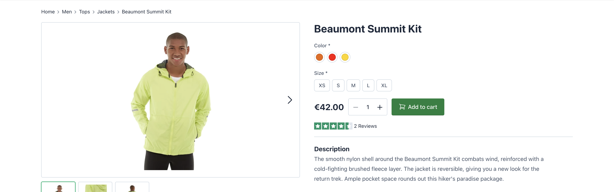
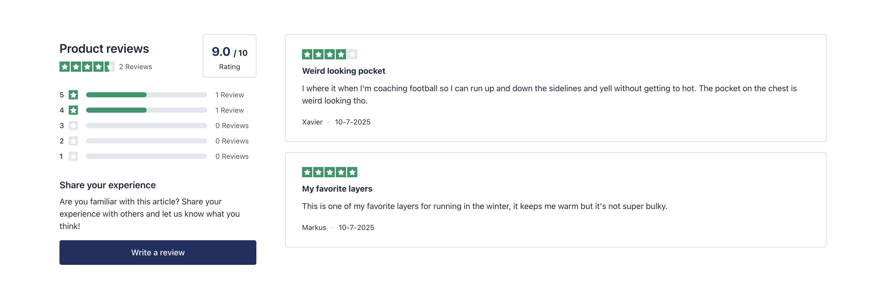

# Rapidez Reviews





## Installation

```bash
composer require rapidez/reviews
```

If you haven't published the Rapidez views yet, publish them with:
```bash
php artisan vendor:publish --provider="Rapidez\Core\RapidezServiceProvider" --tag=views
```

### Configuration

If you'd like to show product reviews on out-of-stock product pages you need to enable this setting in Magento:

> Stores > Settings > Configuration > Catalog > Inventory > Stock Options > Display Out of Stock Products

### Product page

#### Review stars

Add the stars where you'd like in `resources/views/vendor/rapidez/product/overview.blade.php`:
```blade
@if (App::providerIsLoaded('Rapidez\Reviews\ReviewsServiceProvider'))
    @if ($product->reviews_score)
        <x-dynamic-component component="rapidez-reviews::stars" :score="$product->reviews_score :count="$product->reviews_count" />
    @endif
@endif
```

#### Review list

The review list can be added with:
```blade
@if (App::providerIsLoaded('Rapidez\Reviews\ReviewsServiceProvider'))
    <div class="container my-5">
        @include('rapidez-reviews::reviews')
    </div>
@endif
```

#### Microdata

This should be included in `resources/views/vendor/rapidez/product/overview.blade.php` inside the: `<div itemtype="https://schema.org/Product" itemscope>`
```blade
@if (App::providerIsLoaded('Rapidez\Reviews\ReviewsServiceProvider'))
    @include('rapidez-reviews::components.microdata')
@endif
```

### Product listing

#### Review stars

Add somewhere in `resources/views/category/partials/listing/item.blade.php`:
```blade
@if (App::providerIsLoaded('Rapidez\Reviews\ReviewsServiceProvider'))
    <x-dynamic-component component="rapidez-reviews::stars" v-if="item.reviews_count" count="item.reviews_count" score="item.reviews_score" />
@endif
```

## Views

If you need to change the views you can publish them with:
```bash
php artisan vendor:publish --provider="Rapidez\Reviews\ReviewsServiceProvider" --tag=views
```

## License

GNU General Public License v3. Please see [License File](LICENSE) for more information.
